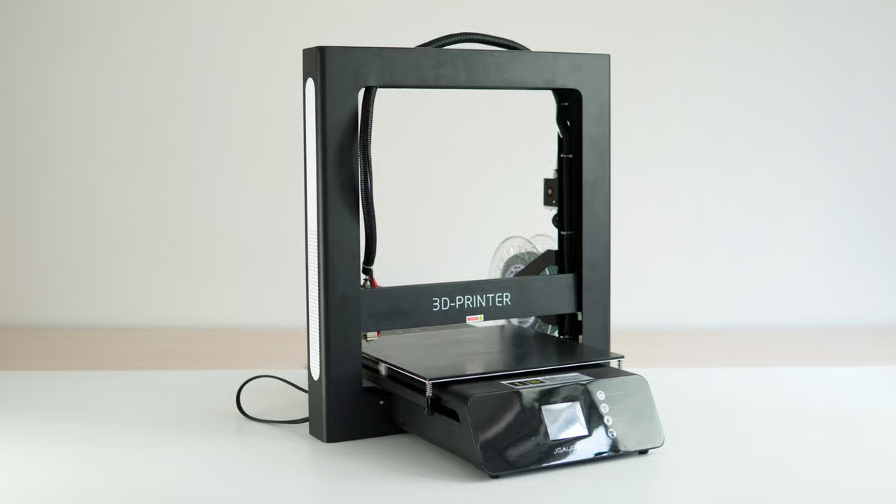
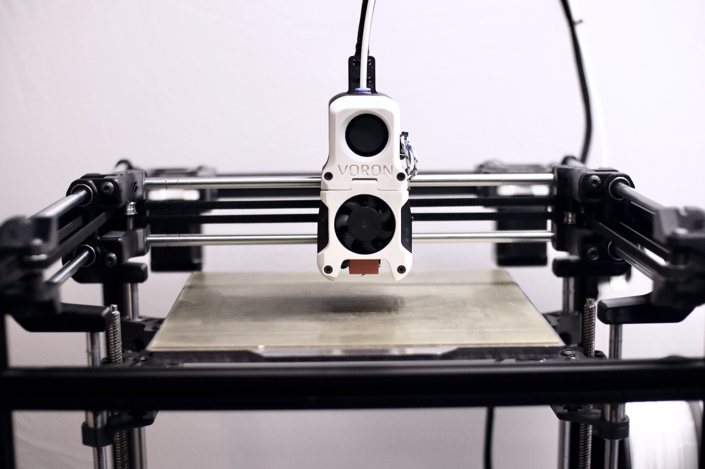

# JGAurora Conversion
This is a project to turn a JGAurora A5 into a more modern printer. The end goal is to approach a Voron Legacy which could then eventually be salvaged into a Voron 2.4. For those unaware of what the JG Aurora A5 is, it is an Ender 3 style clone with linear rods for the axes. 

The [Voron Legacy](https://vorondesign.com/voron_legacy) (*Pictured Below*) is a printer desiged by the Voron Project and is "a throwback 3D printer designed as an homage to VORON1.0"

## Step 1
Step one I wanted to get the printer running a more accessible firmware and after a bit of research it was a clear pick for Klipper . I'm using MainsailOS on a Raspberry Pi 3B because thats what I had on hand but you can use and SBC. Next you need a printer.cfg file for the printer. The way klipper works it takes a configuration file that defines the whole printer which lets it work on almost any hardware.

 Here is my config for my JG Aurora A5: [File](Printer.cfg)

>Note that this config is set up for a stock A5 and would need any changes to reflect anything you have changed on your printer

## Step 2
Step two I wanted to install a BL Touch so that I didnt have to manually level as often. I bought one off of [Amazon](https://www.amazon.com/3Dman-Upgrade-Leveling-Sensor-Printers/dp/B08SK62RMR?dib=eyJ2IjoiMSJ9.h02lGMnJbM641F8a636jjApngaAO2H5hvvmlxyf6feHqBSEECFRKM4ffVp7E0GoP0lgv-HeN4QPsduP6KFL1QCaVK_L-xi_3ll7VQR-VxTNaaMfs2PjFv0I4t83yK1ceds2zVEK8ZM2OsBpGvllT-OClzLJh6BnAWXbAEhYqTYLnb-2HBc_QFMo6W5cmCSr_B1sFPvy1yQueD6NeAPfEU-JjKWOQokq7Qafttl_lypw.BJEyRa-9PeH2ObO0VkBfBeUXHD9ZZhrH5DwNauyg6ds&dib_tag=se&keywords=bl%2Btouch&qid=1773672532&sr=8-7&th=1) and set out to install it. I used this [mount](https://www.thingiverse.com/thing:3042962) from Thingiverse and I plugged it into the sensor port for the Z MAX because it isn't used on this printer and I plugged the servo into the servo port. You can now uncomment the BLTouch segment of the Printer.cfg and follow [Klipper's documentation](https://www.klipper3d.org/BLTouch.html) on how to set it up.
